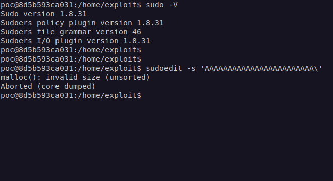
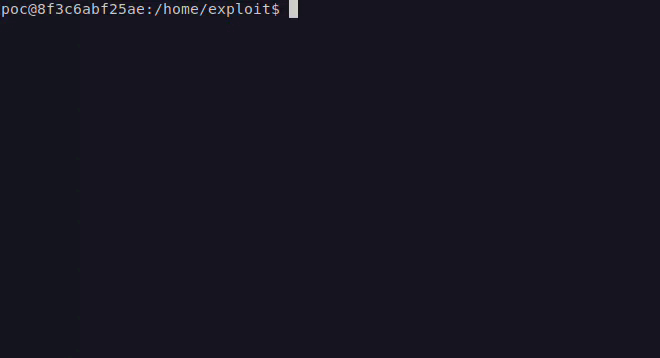

# CVE-2021-3156: Heap-Based Buffer Overflow in Sudo (Baron Samedit)

**Original Source**: https://github.com/arvindshima/CVE-2021-3156

## Root Exploit (No BruteForce)

All research credit: **Qualys Research Team**
Check out the details on their [blog](https://blog.qualys.com/vulnerabilities-research/2021/01/26/cve-2021-3156-heap-based-buffer-overflow-in-sudo-baron-samedit).

Manually installed Ubuntu 20.04 LTS and Sudo version 1.8.31 on Docker container for testing purpose and running the command `sudoedit -s 'AAAAAAAAAAAAAAAAAAAA\'`.

## PoC

